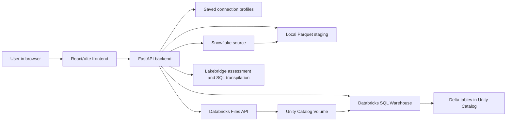
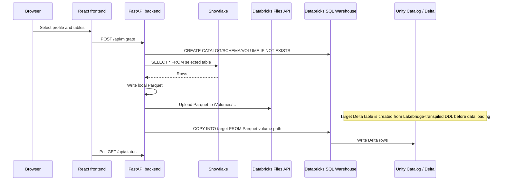

# Migration Suite Architecture

## Why Databricks Tables Are Empty

The source extraction is working. The staged Parquet files under `backend/staging/`
currently contain rows:

| File | Rows |
| --- | ---: |
| `customers.parquet` | 3 |
| `orders.parquet` | 3 |
| `products.parquet` | 3 |

The Databricks app logs show the actual failure is in the Databricks target setup:

- `PERMISSION_DENIED: User does not have CREATE CATALOG on Metastore ...`
- `PERMISSION_DENIED: User does not have CREATE SCHEMA and USE CATALOG on Catalog 'migration_db'.`
- `[SCHEMA_NOT_FOUND] The schema migration_db.source_data cannot be found.`

So rows are being extracted from Snowflake, but the app identity does not have enough
Unity Catalog permissions to create or use the target catalog/schema/volume. Because
the schema/volume cannot be created, the upload/COPY INTO step cannot successfully
load the data.

There is also an app behavior issue: `execute_sql()` logs Databricks SQL failures but
does not raise an exception. That means later migration steps may continue even after
catalog/schema creation failed.

## High-Level System



## Runtime Flow



## Main Components

| Area | Files | Responsibility |
| --- | --- | --- |
| App entrypoint | `app.py` | Starts Uvicorn and serves `backend.main:app`. |
| Backend API | `backend/main.py` | FastAPI routes, in-memory migration status, orchestration. |
| Snowflake client | `backend/migration_engine/snowflake_client.py` | Connects to Snowflake, discovers objects, extracts rows, writes Parquet. |
| Databricks client | `backend/migration_engine/databricks_client.py` | Creates Unity Catalog hierarchy, uploads Parquet, runs `COPY INTO`. |
| Config | `backend/migration_engine/config.py` | Reads `.env`, Databricks secrets, warehouse ID, Snowflake config, volume constants. |
| Validation | `backend/migration_engine/validator.py` | Compares Snowflake and Databricks row counts. |
| Lakebridge | `backend/migration_engine/lakebridge/` | Sole engine for source assessment and Snowflake-to-Databricks SQL transpilation. |
| Frontend API client | `frontend/src/lib/api.ts` | Typed fetch wrapper for backend endpoints. |
| Frontend pages | `frontend/src/pages/` | Lakebridge Analyze & transpile, data-only Migrate, Validate, Connections, and history screens. |
| Databricks app config | `app.yml` | Starts the app and injects `DATABRICKS_SECRET_SCOPE`. |

## Target Names

The Databricks target is derived from the Snowflake database/schema during migration:

- Target catalog: `snowflake_database.lower()`
- Target schema: `snowflake_schema.lower()`
- Target table: `source_table.lower()`
- Staging volume: `staging_volume`
- Staging path: `/Volumes/<catalog>/<schema>/staging_volume/<table>.parquet`

The checked logs show this target:

- Catalog: `migration_db`
- Schema: `source_data`
- Volume: `staging_volume`

## Required Databricks Permissions

The app/service principal or user running the Databricks App needs either:

1. Permission to create the target catalog/schema/volume, or
2. An admin-created catalog/schema/volume plus permissions to use and write to them.

Minimum practical grants for an existing target are:

```sql
GRANT USE CATALOG ON CATALOG migration_db TO `<app-user-or-service-principal>`;
GRANT USE SCHEMA ON SCHEMA migration_db.source_data TO `<app-user-or-service-principal>`;
GRANT CREATE TABLE ON SCHEMA migration_db.source_data TO `<app-user-or-service-principal>`;
GRANT READ VOLUME, WRITE VOLUME ON VOLUME migration_db.source_data.staging_volume TO `<app-user-or-service-principal>`;
```

If the app should create the target itself, it also needs metastore/catalog-level create
privileges, such as `CREATE CATALOG` on the metastore and `CREATE SCHEMA` on the target
catalog.

## Recommended Code Fix

Change `execute_sql()` so failed Databricks statements raise an exception. That will
stop the migration immediately when catalog/schema/volume setup fails and will make
the UI report the real cause instead of continuing into later steps.
